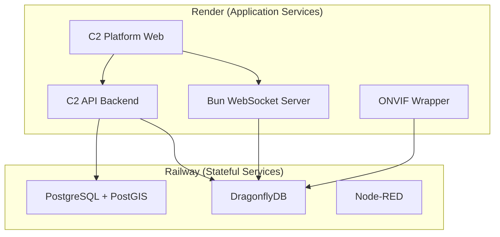

# C2 Platform - Railway & Render Deployment

## Why Railway + Render?

- **Railway**: Perfect for databases, Redis, and backend services (better than Fly for stateful services)
- **Render**: Excellent for web services, background workers, and cron jobs
- Both support Docker, private networking, and the EXACT stack iEnet uses!

## Architecture Overview



## Option 1: Railway (All-in-One)

### Setup Railway Project

```bash
# Install Railway CLI
npm install -g @railway/cli

# Login
railway login

# Create new project
railway init
```

### railway.json Configuration

```json
{
  "$schema": "https://railway.app/railway.schema.json",
  "build": {
    "builder": "NIXPACKS"
  },
  "deploy": {
    "numReplicas": 1,
    "sleepApplication": false,
    "restartPolicyType": "ON_FAILURE",
    "restartPolicyMaxRetries": 10
  },
  "services": {
    "postgres": {
      "image": "postgis/postgis:15-3.3",
      "volumes": {
        "/var/lib/postgresql/data": "pgdata"
      }
    },
    "dragonfly": {
      "image": "docker.dragonflydb.io/dragonflydb/dragonfly:latest",
      "variables": {
        "MAX_MEMORY": "1gb"
      }
    },
    "bun-websocket": {
      "source": "./services/bun-websocket",
      "builder": "DOCKERFILE"
    },
    "onvif-wrapper": {
      "source": "./services/onvif-wrapper",
      "builder": "DOCKERFILE"
    },
    "c2-api": {
      "source": "./services/api",
      "builder": "DOCKERFILE"
    },
    "node-red": {
      "image": "nodered/node-red:latest",
      "volumes": {
        "/data": "nodered-data"
      },
      "variables": {
        "NODE_RED_CREDENTIAL_SECRET": "${{secret.NODE_RED_SECRET}}"
      }
    }
  }
}
```

### Complete Railway Deployment Script

```bash
#!/bin/bash
# deploy-railway.sh

echo "🚂 Deploying C2 Platform to Railway..."

# Create Railway project
railway init c2-platform

# Add PostgreSQL plugin
railway add --plugin postgresql

# Deploy DragonflyDB
cat > dragonfly.dockerfile << 'EOF'
FROM docker.dragonflydb.io/dragonflydb/dragonfly:latest
EXPOSE 6379 6380
CMD ["--logtostderr", "--cache_mode=true", "--maxmemory=2gb", "--enable_http=true", "--http_port=6380"]
EOF

railway up -d dragonfly -f dragonfly.dockerfile

# Deploy services
railway up
```

## Option 2: Render (Production Grade)

### render.yaml Blueprint

```yaml
# render.yaml - Complete C2 Platform
databases:
  - name: c2-postgres
    databaseName: c2_platform
    user: c2admin
    region: oregon
    plan: starter # $7/month
    postgresMajorVersion: 15
    
services:
  # DragonflyDB Cache
  - type: pserv
    name: c2-dragonfly
    runtime: docker
    dockerfilePath: ./services/dragonfly/Dockerfile
    region: oregon
    plan: starter # $7/month
    envVars:
      - key: MAX_MEMORY
        value: 2gb
    disk:
      name: dragonfly-data
      mountPath: /data
      sizeGB: 1

  # Bun WebSocket Server
  - type: web
    name: c2-bun-websocket
    runtime: docker
    dockerContext: ./services/bun-websocket
    dockerfilePath: ./services/bun-websocket/Dockerfile
    region: oregon
    plan: starter
    envVars:
      - key: DRAGONFLY_URL
        fromService:
          name: c2-dragonfly
          type: pserv
          property: hostport
      - key: DATABASE_URL
        fromDatabase:
          name: c2-postgres
          property: connectionString

  # ONVIF Wrapper Service
  - type: web
    name: c2-onvif-wrapper
    runtime: docker
    dockerContext: ./services/onvif-wrapper
    dockerfilePath: ./services/onvif-wrapper/Dockerfile
    region: oregon
    plan: starter
    envVars:
      - key: DRAGONFLY_URL
        fromService:
          name: c2-dragonfly
          type: pserv
          property: hostport
      - key: DISCOVERY_ENABLED
        value: "true"

  # C2 API Backend
  - type: web
    name: c2-api
    runtime: docker
    dockerContext: ./services/api
    dockerfilePath: ./services/api/Dockerfile
    region: oregon
    plan: starter
    envVars:
      - key: DATABASE_URL
        fromDatabase:
          name: c2-postgres
          property: connectionString
      - key: DRAGONFLY_URL
        fromService:
          name: c2-dragonfly
          type: pserv
          property: hostport
      - key: ONVIF_SERVICE_URL
        fromService:
          name: c2-onvif-wrapper
          type: web
          property: host
      - key: JWT_SECRET
        generateValue: true

  # Frontend
  - type: web
    name: c2-platform-web
    runtime: static
    buildCommand: npm run build
    staticPublishPath: ./out
    pullRequestPreviewsEnabled: true
    region: oregon
    envVars:
      - key: NEXT_PUBLIC_API_URL
        fromService:
          name: c2-api
          type: web
          property: host
      - key: NEXT_PUBLIC_WS_URL
        fromService:
          name: c2-bun-websocket
          type: web
          property: host

  # Node-RED
  - type: web
    name: c2-nodered
    runtime: docker
    dockerfilePath: ./services/nodered/Dockerfile
    region: oregon
    plan: starter
    disk:
      name: nodered-data
      mountPath: /data
      sizeGB: 1
```

## Service Implementations

### DragonflyDB Service

```dockerfile
# services/dragonfly/Dockerfile
FROM docker.dragonflydb.io/dragonflydb/dragonfly:latest

EXPOSE 6379 6380

CMD ["dragonfly", \
     "--logtostderr", \
     "--cache_mode=true", \
     "--maxmemory=2gb", \
     "--proactor_threads=4", \
     "--enable_http=true", \
     "--http_port=6380", \
     "--snapshot_cron=0 */6 * * *"]
```

### Bun WebSocket Server

```typescript
// services/bun-websocket/index.ts
import { serve, ServerWebSocket } from "bun";
import Redis from "ioredis";
import { Pool } from "pg";

const redis = new Redis(process.env.DRAGONFLY_URL || "redis://localhost:6379");
const pg = new Pool({ connectionString: process.env.DATABASE_URL });

interface WSClient {
  id: string;
  ws: ServerWebSocket;
  subscriptions: Set<string>;
}

const clients = new Map<string, WSClient>();

// Boomerang UDP listener
const boomerangSocket = Bun.udpSocket({
  port: 4001,
  handler: {
    async data(socket, buf, port, addr) {
      const event = parseBoomerangPacket(buf);
      
      // Check zone using PostGIS
      const result = await pg.query(`
        SELECT z.*, 
               ST_Contains(z.polygon, ST_SetSRID(ST_MakePoint($1, $2), 4326)) as in_zone
        FROM zones z
        WHERE ST_Contains(z.polygon, ST_SetSRID(ST_MakePoint($1, $2), 4326))
        ORDER BY CASE type 
          WHEN 'red' THEN 1 
          WHEN 'yellow' THEN 2 
          ELSE 3 
        END
        LIMIT 1
      `, [event.lon, event.lat]);
      
      const zone = result.rows[0];
      
      // Store event
      await pg.query(`
        INSERT INTO events (type, source, confidence, location, zone_id, metadata)
        VALUES ($1, $2, $3, ST_SetSRID(ST_MakePoint($4, $5), 4326), $6, $7)
        RETURNING *
      `, ['gunshot', 'boomerang', event.confidence, event.lon, event.lat, zone?.id, event]);
      
      // Auto-response for red zone
      if (zone?.type === 'red' && zone?.auto_response && event.confidence > 0.8) {
        await redis.lpush('queue:lrad_activation', JSON.stringify({
          event_id: event.id,
          zone: zone.name,
          spl: zone.day_spl,
          duration: 10,
          pattern: 'deterrent'
        }));
      }
      
      // Broadcast to WebSocket clients
      broadcast({
        type: 'event',
        data: { ...event, zone }
      });
    }
  }
});

// WebSocket server
const server = serve({
  port: process.env.PORT || 3000,
  
  fetch(req, server) {
    const url = new URL(req.url);
    
    // Health check for Render
    if (url.pathname === "/health") {
      return new Response("OK");
    }
    
    // WebSocket upgrade
    if (req.headers.get("upgrade") === "websocket") {
      const success = server.upgrade(req);
      return success ? undefined : new Response("Upgrade failed", { status: 400 });
    }
    
    // Thermal webhook endpoint
    if (url.pathname === "/webhook/thermal" && req.method === "POST") {
      return handleThermalWebhook(req);
    }
    
    return new Response("C2 WebSocket Server");
  },
  
  websocket: {
    open(ws) {
      const id = crypto.randomUUID();
      clients.set(id, { id, ws, subscriptions: new Set() });
      
      ws.send(JSON.stringify({
        type: "connected",
        id,
        timestamp: new Date()
      }));
      
      console.log(`Client connected: ${id}`);
    },
    
    message(ws, message) {
      const client = findClient(ws);
      if (!client) return;
      
      const data = JSON.parse(message.toString());
      
      switch (data.type) {
        case "subscribe":
          client.subscriptions.add(data.channel);
          break;
        case "ptz":
          handlePTZCommand(data);
          break;
        case "lrad":
          handleLRADCommand(data);
          break;
      }
    },
    
    close(ws) {
      const client = findClient(ws);
      if (client) {
        clients.delete(client.id);
        console.log(`Client disconnected: ${client.id}`);
      }
    }
  }
});

function broadcast(message: any) {
  const payload = JSON.stringify(message);
  for (const client of clients.values()) {
    client.ws.send(payload);
  }
}

async function handleThermalWebhook(req: Request) {
  const data = await req.json();
  
  // Process thermal event
  const event = {
    type: 'thermal_detection',
    source: data.camera_id,
    confidence: data.confidence,
    location: data.location,
    metadata: data
  };
  
  await pg.query(`
    INSERT INTO events (type, source, confidence, location, metadata)
    VALUES ($1, $2, $3, ST_SetSRID(ST_MakePoint($4, $5), 4326), $6)
  `, [event.type, event.source, event.confidence, data.lon, data.lat, event.metadata]);
  
  broadcast({ type: 'event', data: event });
  
  return new Response("OK");
}

function parseBoomerangPacket(buffer: Buffer) {
  // Parse Boomerang UDP protocol
  return {
    id: crypto.randomUUID(),
    timestamp: new Date(),
    lat: buffer.readFloatLE(0),
    lon: buffer.readFloatLE(4),
    confidence: buffer.readFloatLE(8),
    classification: 'gunshot',
    audio_signature: {
      peak_db: buffer.readUInt16LE(12),
      duration_ms: buffer.readUInt16LE(14),
      frequency_hz: buffer.readUInt16LE(16)
    }
  };
}

console.log(`Bun WebSocket Server running on port ${server.port}`);
```

### ONVIF Wrapper Service

```typescript
// services/onvif-wrapper/index.ts
import express from 'express';
import { Discovery, Cam } from 'onvif';
import Redis from 'ioredis';
import { WebSocketServer } from 'ws';

const app = express();
const redis = new Redis(process.env.DRAGONFLY_URL!);
const wss = new WebSocketServer({ port: 8083 });

const cameras = new Map<string, any>();

// Auto-discover cameras
async function discoverCameras() {
  Discovery.probe((err, cams) => {
    if (err) return console.error(err);
    
    cams.forEach(cam => {
      if (!cameras.has(cam.hostname)) {
        connectCamera(cam);
      }
    });
  });
}

function connectCamera(camInfo: any) {
  const camera = new Cam({
    hostname: camInfo.hostname,
    username: process.env.CAMERA_USERNAME || 'admin',
    password: process.env.CAMERA_PASSWORD || 'admin',
    port: camInfo.port
  }, function(err) {
    if (err) return console.error(`Failed to connect: ${err}`);
    
    console.log(`Connected to camera: ${camInfo.hostname}`);
    
    // Get capabilities
    this.getCapabilities((err, caps) => {
      if (!err) {
        cameras.set(camInfo.hostname, {
          info: camInfo,
          cam: this,
          capabilities: caps,
          streams: {}
        });
        
        // Get stream URL
        this.getStreamUri({
          stream: 'RTP-Unicast',
          protocol: 'RTSP'
        }, (err, stream) => {
          if (!err) {
            const camera = cameras.get(camInfo.hostname);
            camera.streams.main = stream.uri;
            
            // Store in Redis
            redis.hset(`camera:${camInfo.hostname}`, {
              'rtsp_url': stream.uri,
              'name': camInfo.name || camInfo.hostname,
              'status': 'online'
            });
          }
        });
        
        // Subscribe to events if available
        if (caps.events) {
          subscribeToEvents(this, camInfo.hostname);
        }
      }
    });
  });
}

function subscribeToEvents(camera: any, hostname: string) {
  camera.createPullPointSubscription((err, subscription) => {
    if (err) return;
    
    const pullMessages = () => {
      subscription.pullMessages({
        timeout: 60000,
        messageLimit: 10
      }, async (err, messages) => {
        if (!err && messages?.notificationMessage) {
          for (const msg of messages.notificationMessage) {
            await processAnalyticsEvent(hostname, msg);
          }
        }
        setTimeout(pullMessages, 1000);
      });
    };
    
    pullMessages();
  });
}

async function processAnalyticsEvent(cameraId: string, message: any) {
  const event = {
    camera_id: cameraId,
    type: 'motion',
    timestamp: new Date(),
    data: message
  };
  
  // Check if it's a line crossing or intrusion
  if (message.topic?._.includes('CrossingLine')) {
    event.type = 'line_crossing';
  } else if (message.topic?._.includes('FieldDetector')) {
    event.type = 'intrusion';
  }
  
  // Push to Redis queue
  await redis.lpush('events:camera', JSON.stringify(event));
  
  // Broadcast to WebSocket clients
  wss.clients.forEach(client => {
    if (client.readyState === 1) {
      client.send(JSON.stringify(event));
    }
  });
}

// REST API
app.use(express.json());

app.get('/health', (req, res) => {
  res.json({ status: 'healthy', cameras: cameras.size });
});

app.get('/api/cameras', (req, res) => {
  const cameraList = Array.from(cameras.values()).map(cam => ({
    hostname: cam.info.hostname,
    name: cam.info.name,
    status: 'online',
    streams: cam.streams,
    capabilities: cam.capabilities ? {
      ptz: !!cam.capabilities.ptz,
      analytics: !!cam.capabilities.analytics,
      events: !!cam.capabilities.events
    } : {}
  }));
  
  res.json(cameraList);
});

app.post('/api/cameras/:hostname/ptz', async (req, res) => {
  const camera = cameras.get(req.params.hostname);
  if (!camera) {
    return res.status(404).json({ error: 'Camera not found' });
  }
  
  const { action, preset, pan, tilt, zoom } = req.body;
  const cam = camera.cam;
  const profile = camera.capabilities.media.profiles[0].$.token;
  
  try {
    switch (action) {
      case 'preset':
        cam.gotoPreset({ ProfileToken: profile, PresetToken: preset }, (err) => {
          if (err) throw err;
          res.json({ status: 'ok', preset });
        });
        break;
        
      case 'absolute':
        cam.absoluteMove({
          ProfileToken: profile,
          Position: {
            PanTilt: { x: pan, y: tilt },
            Zoom: { x: zoom }
          }
        }, (err) => {
          if (err) throw err;
          res.json({ status: 'ok', position: { pan, tilt, zoom } });
        });
        break;
        
      case 'continuous':
        cam.continuousMove({
          ProfileToken: profile,
          Velocity: {
            PanTilt: { x: pan, y: tilt },
            Zoom: { x: zoom || 0 }
          }
        }, (err) => {
          if (err) throw err;
          res.json({ status: 'moving' });
        });
        break;
        
      case 'stop':
        cam.stop({ ProfileToken: profile }, (err) => {
          if (err) throw err;
          res.json({ status: 'stopped' });
        });
        break;
    }
  } catch (error) {
    res.status(500).json({ error: error.message });
  }
});

app.get('/api/cameras/:hostname/snapshot', async (req, res) => {
  const camera = cameras.get(req.params.hostname);
  if (!camera) {
    return res.status(404).json({ error: 'Camera not found' });
  }
  
  camera.cam.getSnapshotUri({}, (err, snapshot) => {
    if (err) {
      return res.status(500).json({ error: err.message });
    }
    
    // Fetch and proxy the snapshot
    fetch(snapshot.uri, {
      headers: {
        'Authorization': 'Basic ' + Buffer.from(`${process.env.CAMERA_USERNAME}:${process.env.CAMERA_PASSWORD}`).toString('base64')
      }
    })
    .then(response => response.arrayBuffer())
    .then(buffer => {
      res.set('Content-Type', 'image/jpeg');
      res.send(Buffer.from(buffer));
    })
    .catch(error => {
      res.status(500).json({ error: error.message });
    });
  });
});

// WebSocket for real-time PTZ control
wss.on('connection', (ws) => {
  console.log('PTZ WebSocket client connected');
  
  ws.on('message', (message) => {
    const data = JSON.parse(message.toString());
    
    if (data.type === 'ptz') {
      const camera = cameras.get(data.hostname);
      if (camera) {
        camera.cam.continuousMove({
          ProfileToken: camera.capabilities.media.profiles[0].$.token,
          Velocity: {
            PanTilt: { x: data.pan, y: data.tilt },
            Zoom: { x: data.zoom || 0 }
          }
        });
      }
    }
  });
});

// Start discovery
setInterval(discoverCameras, 30000);
discoverCameras();

const PORT = process.env.PORT || 8082;
app.listen(PORT, () => {
  console.log(`ONVIF Wrapper running on port ${PORT}`);
});
```

### C2 API Backend

```typescript
// services/api/index.ts
import express from 'express';
import { Pool } from 'pg';
import Redis from 'ioredis';
import cors from 'cors';
import jwt from 'jsonwebtoken';

const app = express();
const pg = new Pool({ connectionString: process.env.DATABASE_URL });
const redis = new Redis(process.env.DRAGONFLY_URL!);

app.use(cors());
app.use(express.json());

// Initialize database
async function initDB() {
  await pg.query(`
    CREATE EXTENSION IF NOT EXISTS postgis;
    
    CREATE TABLE IF NOT EXISTS zones (
      id UUID DEFAULT gen_random_uuid() PRIMARY KEY,
      name TEXT NOT NULL,
      type TEXT,
      polygon GEOMETRY(Polygon, 4326),
      day_spl INTEGER DEFAULT 95,
      night_spl INTEGER DEFAULT 85,
      auto_response BOOLEAN DEFAULT false,
      created_at TIMESTAMPTZ DEFAULT NOW()
    );
    
    CREATE TABLE IF NOT EXISTS events (
      id UUID DEFAULT gen_random_uuid() PRIMARY KEY,
      type TEXT,
      source TEXT,
      confidence FLOAT,
      location GEOMETRY(Point, 4326),
      zone_id UUID REFERENCES zones(id),
      metadata JSONB,
      acknowledged BOOLEAN DEFAULT false,
      created_at TIMESTAMPTZ DEFAULT NOW()
    );
    
    CREATE TABLE IF NOT EXISTS responses (
      id UUID DEFAULT gen_random_uuid() PRIMARY KEY,
      event_id UUID REFERENCES events(id),
      action TEXT,
      parameters JSONB,
      success BOOLEAN DEFAULT true,
      executed_at TIMESTAMPTZ DEFAULT NOW()
    );
    
    CREATE INDEX IF NOT EXISTS idx_zones_polygon ON zones USING GIST(polygon);
    CREATE INDEX IF NOT EXISTS idx_events_location ON events USING GIST(location);
  `);
}

initDB().catch(console.error);

// Health check
app.get('/health', (req, res) => {
  res.json({ status: 'healthy' });
});

// Zones CRUD
app.get('/api/zones', async (req, res) => {
  const result = await pg.query('SELECT * FROM zones');
  res.json(result.rows);
});

app.post('/api/zones', async (req, res) => {
  const { name, type, polygon, day_spl, night_spl, auto_response } = req.body;
  
  const result = await pg.query(`
    INSERT INTO zones (name, type, polygon, day_spl, night_spl, auto_response)
    VALUES ($1, $2, ST_GeomFromGeoJSON($3), $4, $5, $6)
    RETURNING *
  `, [name, type, JSON.stringify(polygon), day_spl, night_spl, auto_response]);
  
  res.json(result.rows[0]);
});

app.put('/api/zones/:id', async (req, res) => {
  const { name, type, polygon, day_spl, night_spl, auto_response } = req.body;
  
  const result = await pg.query(`
    UPDATE zones 
    SET name = $2, type = $3, polygon = ST_GeomFromGeoJSON($4), 
        day_spl = $5, night_spl = $6, auto_response = $7
    WHERE id = $1
    RETURNING *
  `, [req.params.id, name, type, JSON.stringify(polygon), day_spl, night_spl, auto_response]);
  
  res.json(result.rows[0]);
});

// Events
app.get('/api/events', async (req, res) => {
  const { limit = 100, offset = 0 } = req.query;
  
  const result = await pg.query(`
    SELECT e.*, z.name as zone_name, z.type as zone_type
    FROM events e
    LEFT JOIN zones z ON e.zone_id = z.id
    ORDER BY e.created_at DESC
    LIMIT $1 OFFSET $2
  `, [limit, offset]);
  
  res.json(result.rows);
});

app.post('/api/events/:id/acknowledge', async (req, res) => {
  await pg.query('UPDATE events SET acknowledged = true WHERE id = $1', [req.params.id]);
  res.json({ status: 'acknowledged' });
});

// LRAD Control
app.post('/api/lrad/activate', async (req, res) => {
  const { duration = 10, pattern = 'deterrent', spl = 95, event_id } = req.body;
  
  // Queue activation
  await redis.lpush('queue:lrad', JSON.stringify({
    duration,
    pattern,
    spl,
    event_id,
    timestamp: new Date()
  }));
  
  // Log response
  if (event_id) {
    await pg.query(`
      INSERT INTO responses (event_id, action, parameters)
      VALUES ($1, 'lrad_activation', $2)
    `, [event_id, { duration, pattern, spl }]);
  }
  
  res.json({ status: 'queued', duration, pattern, spl });
});

// PTZ Control proxy
app.post('/api/ptz/:camera/control', async (req, res) => {
  const onvifUrl = process.env.ONVIF_SERVICE_URL || 'http://localhost:8082';
  
  const response = await fetch(`${onvifUrl}/api/cameras/${req.params.camera}/ptz`, {
    method: 'POST',
    headers: { 'Content-Type': 'application/json' },
    body: JSON.stringify(req.body)
  });
  
  const data = await response.json();
  res.json(data);
});

// System status
app.get('/api/status', async (req, res) => {
  const [events, zones, queueSize] = await Promise.all([
    pg.query('SELECT COUNT(*) FROM events WHERE created_at > NOW() - INTERVAL \'24 hours\''),
    pg.query('SELECT COUNT(*) FROM zones'),
    redis.llen('queue:lrad')
  ]);
  
  res.json({
    events_today: parseInt(events.rows[0].count),
    zones_configured: parseInt(zones.rows[0].count),
    lrad_queue: queueSize,
    timestamp: new Date()
  });
});

const PORT = process.env.PORT || 8000;
app.listen(PORT, () => {
  console.log(`C2 API running on port ${PORT}`);
});
```

## Deploy Everything

### Option A: Railway (Simplest)

```bash
# One-click deploy with Railway
railway login
railway init

# Deploy from GitHub
railway link
railway up

# Add services via dashboard or CLI
railway add postgresql
railway add redis
railway service create bun-websocket
railway service create onvif-wrapper
railway service create c2-api
railway service create c2-web

# Environment variables are auto-injected!
```

### Option B: Render (More Control)

```bash
# Create render.yaml in your repo root
# Push to GitHub
# Go to dashboard.render.com

# Click "New" → "Blueprint"
# Connect GitHub repo
# Select render.yaml
# Deploy!

# Everything auto-deploys on git push
```

## Cost Comparison

### Railway
- PostgreSQL: $5/month (starter)
- Redis: $5/month
- Services: ~$5/month each
- **Total: ~$30/month**

### Render
- PostgreSQL: $7/month (starter)
- Redis: $7/month (via Docker)
- Services: $7/month each
- **Total: ~$35/month**

### Production Scale (50+ sites)
- Use Railway's Pro plan or Render's Team plan
- Add read replicas for PostgreSQL
- Scale services to multiple instances
- **Total: ~$200-500/month**

## Access Your Deployed System

### Railway URLs
```
API:     https://c2-api.up.railway.app
WebSocket: wss://c2-bun-websocket.up.railway.app
ONVIF:   https://c2-onvif-wrapper.up.railway.app
Web:     https://c2-platform-web.up.railway.app
Node-RED: https://c2-nodered.up.railway.app
```

### Render URLs
```
API:     https://c2-api.onrender.com
WebSocket: wss://c2-bun-websocket.onrender.com
ONVIF:   https://c2-onvif-wrapper.onrender.com
Web:     https://c2-platform-web.onrender.com
```

## One-Click Deploy Buttons

Add these to your README:

```markdown
[](https://railway.app/template/c2-platform)

[](https://render.com/deploy?repo=https://github.com/yourusername/c2-platform)
```